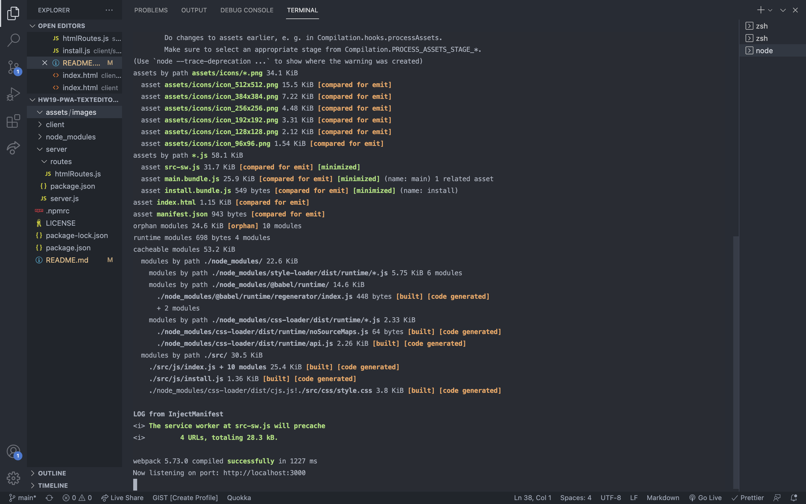
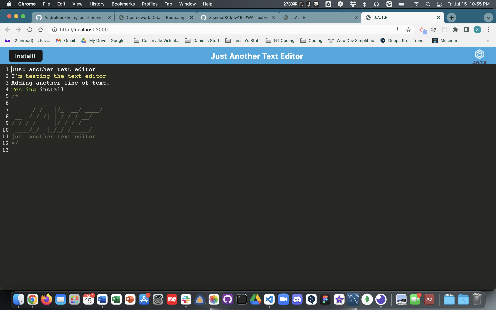

# PWA Text Editor

Designed by: Jessie Doherty

## Description

This app is a single-page application that meets the PWA criteria.

- What was your motivation?
- Answer: To get a deeper understanding of PWA.
- Why did you build this project?
- Answer: Using all I have learned, Node.js, Express.js, MongoDB and PWA to build a small app and show it to potential recruiter.
- What problem does it solve?
- Answer: A PWA text editor that can record the entry of a user.
- What did you learn?
- Answer: PWA, NPM packages for using PWA.

## Installation

Please tell us the 3 simple steps for installing your app.

- Step 1: Download the app, run `npm install`.
- Step 2: Run `npm run start` to start the app.
- Step 3: On localhost server, type in anything you want. Or you can go to the heroku site.

## Usage

- Screenshots of the App

  - Terminal side:
    
  - Localhost side:
    

## License

    MIT License

    Copyright (c) 2022 Jessie Doherty

    Permission is hereby granted, free of charge, to any person obtaining a copy
    of this software and associated documentation files (the "Software"), to deal
    in the Software without restriction, including without limitation the rights
    to use, copy, modify, merge, publish, distribute, sublicense, and/or sell
    copies of the Software, and to permit persons to whom the Software is
    furnished to do so, subject to the following conditions:

    The above copyright notice and this permission notice shall be included in all
    copies or substantial portions of the Software.

    THE SOFTWARE IS PROVIDED "AS IS", WITHOUT WARRANTY OF ANY KIND, EXPRESS OR
    IMPLIED, INCLUDING BUT NOT LIMITED TO THE WARRANTIES OF MERCHANTABILITY,
    FITNESS FOR A PARTICULAR PURPOSE AND NONINFRINGEMENT. IN NO EVENT SHALL THE
    AUTHORS OR COPYRIGHT HOLDERS BE LIABLE FOR ANY CLAIM, DAMAGES OR OTHER
    LIABILITY, WHETHER IN AN ACTION OF CONTRACT, TORT OR OTHERWISE, ARISING FROM,
    OUT OF OR IN CONNECTION WITH THE SOFTWARE OR THE USE OR OTHER DEALINGS IN THE
    SOFTWARE.

    ---

## 🏆 Miscellaneous

## Badges

- 
- 

## Features

- A single-page app that can record the user's entry and store it to IndexedDB.

## How to Contribute

- This repo is free and open for any contributions from collaborators.

## URLs

- [Github Repo](https://github.com/zhuzhu930/hw19-PWA-TextEditor-JD)
- [Heroku](https://limitless-hollows-49734.herokuapp.com/)
